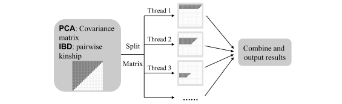

# Overview

Genome-wide association studies (GWAS) are widely used to help determine the genetic basis of diseases and traits, but they pose many computational challenges. We developed [gdsfmt](http://www.bioconductor.org/packages/gdsfmt) and [SNPRelate](http://www.bioconductor.org/packages/SNPRelate) (high-performance computing R packages for multi-core symmetric multiprocessing computer architectures) to accelerate two key computations in GWAS: principal component analysis (PCA) and relatedness analysis using identity-by-descent (IBD) measures^1^. The kernels of our algorithms are written in C/C++ and have been highly optimized. The calculations of the genetic covariance matrix in PCA and pairwise IBD coefficients are split into non-overlapping parts and assigned to multiple cores for performance acceleration, as shown in Figure 1.

GDS is also used by the R/Bioconductor package [GWASTools](http://www.bioconductor.org/packages/GWASTools) as one of its data storage formats^2,3^. [GWASTools](http://www.bioconductor.org/packages/GWASTools) provides many functions for quality control and analysis of GWAS, including statistics by SNP or scan, batch quality, chromosome anomalies, association tests, etc. The extended GDS format is implemented in the [SeqArray](http://www.bioconductor.org/packages/SeqArray) package to support the storage of single nucleotide variation (SNV), insertion/deletion polymorphism (indel) and structural variation calls. It is strongly suggested to use SeqArray for large-scale  whole-exome and whole-genome sequencing variant data instead of SNPRelate.




**Figure 1**: Flowchart of parallel computing for principal component analysis and identity-by-descent analysis.

~

R is the most popular statistical programming environment, but one not typically optimized for high performance or parallel computing which would ease the burden of large-scale GWAS calculations. To overcome these limitations we have developed a project named CoreArray ([http://corearray.sourceforge.net/](http://corearray.sourceforge.net/)) that includes two R packages: [gdsfmt](http://www.bioconductor.org/packages/gdsfmt) to provide efficient, platform independent memory and file management for genome-wide numerical data, and [SNPRelate](http://www.bioconductor.org/packages/SNPRelate) to solve large-scale, numerically intensive GWAS calculations (i.e., PCA and IBD) on multi-core symmetric multiprocessing (SMP) computer architectures.

This vignette takes the user through the relatedness and principal component analysis used for genome wide association data. The methods in these vignettes have been introduced in the paper of Zheng *et al.* (2012)^1^. For replication purposes the data used here are taken from the HapMap Phase II project. These data were kindly provided by the Center for Inherited Disease Research (CIDR) at Johns Hopkins University and the Broad Institute of MIT and Harvard University (Broad). The data supplied here should not be used for any purpose other than this tutorial.


$~$

# Installation of the package SNPRelate

To install the package [SNPRelate](http://www.bioconductor.org/packages/SNPRelate), you need a current version (>=2.14.0) of [R](http://www.r-project.org) and the R package [gdsfmt](http://www.bioconductor.org/packages/gdsfmt). After installing [R](http://www.r-project.org) you can run the following commands from the [R](http://www.r-project.org) command shell to install the R package [SNPRelate](http://www.bioconductor.org/packages/SNPRelate).

Install the package from Bioconductor repository:
```{r eval=FALSE}
if (!requireNamespace("BiocManager", quietly=TRUE))
    install.packages("BiocManager")
BiocManager::install("gdsfmt")
BiocManager::install("SNPRelate")
```

Install the development version from Github:
```{r eval=FALSE}
library("devtools")
install_github("zhengxwen/gdsfmt")
install_github("zhengxwen/SNPRelate")
```
The `install_github()` approach requires that you build from source, i.e. `make` and compilers must be installed on your system -- see the [R FAQ](http://cran.r-project.org/faqs.html) for your operating system; you may also need to install dependencies manually.


$~$

# Preparing Data

## Data formats used in SNPRelate

To support efficient memory management for genome-wide numerical data, the [gdsfmt](http://www.bioconductor.org/packages/gdsfmt) package provides the genomic data structure (GDS) file format for array-oriented bioinformatic data, which is a container for storing annotation data and SNP genotypes. In this format each byte encodes up to four SNP genotypes thereby reducing file size and access time. The GDS format supports data blocking so that only the subset of data that is being processed needs to reside in memory. GDS formatted data is also designed for efficient random access to large data sets. A tutorial for the R/Bioconductor package [gdsfmt](http://www.bioconductor.org/packages/gdsfmt) can be found: [http://corearray.sourceforge.net/tutorials/gdsfmt/](http://corearray.sourceforge.net/tutorials/gdsfmt/).

```{r}
# Load the R packages: gdsfmt and SNPRelate
library(gdsfmt)
library(SNPRelate)
```

Here is a typical GDS file:
```{r}
snpgdsSummary(snpgdsExampleFileName())
```

`snpgdsExampleFileName()` returns the file name of a GDS file used as an example in [SNPRelate](http://www.bioconductor.org/packages/SNPRelate), and it is a subset of data from the HapMap project and the samples were genotyped by the Center for Inherited Disease Research (CIDR) at Johns Hopkins University and the Broad Institute of MIT and Harvard University (Broad). `snpgdsSummary()` summarizes the genotypes stored in the GDS file. "Individual-major mode" indicates listing all SNPs for an individual before listing the SNPs for the next individual, etc. Conversely, "SNP-major mode" indicates listing all individuals for the first SNP before listing all individuals for the second SNP, etc. Sometimes "SNP-major mode" is more computationally efficient than "individual-major mode". For example, the calculation of genetic covariance matrix deals with genotypic data SNP by SNP, and then "SNP-major mode" should be more efficient.

```{r}
# Open a GDS file
(genofile <- snpgdsOpen(snpgdsExampleFileName()))
```

The output lists all variables stored in the GDS file. At the first level, it stores variables *sample.id*, *snp.id*, etc. The additional information are displayed in the braces indicating data type, size, compressed or not + compression ratio. The second-level variables *sex* and *pop.group* are both stored in the folder of *sample.annot*. All of the functions in [SNPRelate](http://www.bioconductor.org/packages/SNPRelate) require a minimum set of variables in the annotation data. The minimum required variables are

* *sample.id*, a unique identifier for each sample.
* *snp.id*, a unique identifier for each SNP.
* *snp.position*, the base position of each SNP on the chromosome, and 0 for unknown position; it does not allow NA.
* *snp.chromosome*, an integer or character mapping for each chromosome. Integer: numeric values 1-26, mapped in order from 1-22,  23=X, 24=XY (the pseudoautosomal region), 25=Y, 26=M (the mitochondrial probes), and 0 for probes with unknown positions; it does not allow NA. Character: "X", "XY", "Y" and "M" can be used here, and a blank string indicating unknown position.
* *genotype*, a SNP genotypic matrix (i.e., the number of A alleles). SNP-major mode: $n_{sample} \times n_{snp}$, individual-major mode: $n_{snp} \times n_{sample}$.

Users can define the numeric chromosome codes which are stored with the variable *snp.chromosome* as its attributes when
*snp.chromosome* is numeric only. For example, *snp.chromosome* has the attributes of chromosome coding:
```{r}
# Get the attributes of chromosome coding
get.attr.gdsn(index.gdsn(genofile, "snp.chromosome"))
```
*autosome.start* is the starting numeric code of autosomes, and *autosome.end* is the last numeric code of autosomes. `put.attr.gdsn()` can be used to add a new attribute or modify an existing attribute.

There are four possible values stored in the variable *genotype*: 0, 1, 2 and 3. For bi-allelic SNP sites, "0" indicates two B alleles, "1" indicates one A allele and one B allele, "2" indicates two A alleles, and "3" is a missing genotype. For multi-allelic sites, it is a count of the reference allele (3 meaning no call). "Bit2" indicates that each byte encodes up to four SNP genotypes since one byte consists of eight bits.
```{r}
# Take out genotype data for the first 3 samples and the first 5 SNPs
(g <- read.gdsn(index.gdsn(genofile, "genotype"), start=c(1,1), count=c(5,3)))
```
Or take out genotype data with sample and SNP IDs, and four possible values are returned 0, 1, 2 and NA (3 is replaced by NA):
```{r eval=FALSE}
g <- snpgdsGetGeno(genofile, sample.id=..., snp.id=...)
```

```{r}
# Get the attribute of genotype
get.attr.gdsn(index.gdsn(genofile, "genotype"))
```
The returned value could be either "snp.order" or "sample.order", indicating individual-major mode (snp is the first dimension) and SNP-major mode (sample is the first dimension) respectively.

```{r}
# Take out snp.id
head(read.gdsn(index.gdsn(genofile, "snp.id")))
# Take out snp.rs.id
head(read.gdsn(index.gdsn(genofile, "snp.rs.id")))
```

There are two additional and optional variables:

1. *snp.rs.id*, a character string for reference SNP ID that may not be unique.
2. *snp.allele*, it is not necessary for the analysis, but it is necessary when merging genotypes from different platforms. The format of *snp.allele* is "A allele/B allele", like "T/G" where T is A allele and G is B allele.

The information of sample annotation can be obtained by the same function `read.gdsn()`. For example, population information. "VStr8" indicates a character-type variable.
```{r}
# Read population information
pop <- read.gdsn(index.gdsn(genofile, path="sample.annot/pop.group"))
table(pop)

# Close the GDS file
snpgdsClose(genofile)
```


$~$

## Create a GWAS SNP GDS File

### Using snpgdsCreateGeno()

The function `snpgdsCreateGeno()` can be used to create a GDS file. The first argument should be a numeric matrix for SNP genotypes. There are possible values stored in the input genotype matrix: 0, 1, 2 and other values. "0" indicates two B alleles, "1" indicates one A allele and one B allele, "2" indicates two A alleles, and other values indicate a missing genotype. The SNP matrix can be either $n_{sample} \times n_{snp}$ (*snpfirstdim=FALSE*, the argument in `snpgdsCreateGeno()`) or $n_{snp} \times n_{sample}$ (*snpfirstdim=TRUE*).

For example,

```{r}
# Load data
data(hapmap_geno)

# Create a gds file
snpgdsCreateGeno("test.gds", genmat = hapmap_geno$genotype,
    sample.id = hapmap_geno$sample.id, snp.id = hapmap_geno$snp.id,
    snp.chromosome = hapmap_geno$snp.chromosome,
    snp.position = hapmap_geno$snp.position,
    snp.allele = hapmap_geno$snp.allele, snpfirstdim=TRUE)

# Open the GDS file
(genofile <- snpgdsOpen("test.gds"))

# Close the GDS file
snpgdsClose(genofile)
```


### Using the gdsfmt package

In the following code, the functions `createfn.gds()`, `add.gdsn()`, `put.attr.gdsn()`, `write.gdsn()` and `index.gdsn()` are defined in the package [gdsfmt](http://www.bioconductor.org/packages/gdsfmt):

```{r eval=FALSE}
# Create a new GDS file
newfile <- createfn.gds("your_gds_file.gds")

# add a flag
put.attr.gdsn(newfile$root, "FileFormat", "SNP_ARRAY")

# Add variables
add.gdsn(newfile, "sample.id", sample.id)
add.gdsn(newfile, "snp.id", snp.id)
add.gdsn(newfile, "snp.chromosome", snp.chromosome)
add.gdsn(newfile, "snp.position", snp.position)
add.gdsn(newfile, "snp.allele", c("A/G", "T/C", ...))

#####################################################################
# Create a snp-by-sample genotype matrix

# Add genotypes
var.geno <- add.gdsn(newfile, "genotype",
    valdim=c(length(snp.id), length(sample.id)), storage="bit2")

# Indicate the SNP matrix is snp-by-sample
put.attr.gdsn(var.geno, "snp.order")

# Write SNPs into the file sample by sample
for (i in 1:length(sample.id))
{
    g <- ...
    write.gdsn(var.geno, g, start=c(1,i), count=c(-1,1))
}

#####################################################################
# OR, create a sample-by-snp genotype matrix

# Add genotypes
var.geno <- add.gdsn(newfile, "genotype",
    valdim=c(length(sample.id), length(snp.id)), storage="bit2")

# Indicate the SNP matrix is sample-by-snp
put.attr.gdsn(var.geno, "sample.order")

# Write SNPs into the file sample by sample
for (i in 1:length(snp.id))
{
    g <- ...
    write.gdsn(var.geno, g, start=c(1,i), count=c(-1,1))
}

# Get a description of chromosome codes
#   allowing to define a new chromosome code, e.g., snpgdsOption(Z=27)
option <- snpgdsOption()
var.chr <- index.gdsn(newfile, "snp.chromosome")
put.attr.gdsn(var.chr, "autosome.start", option$autosome.start)
put.attr.gdsn(var.chr, "autosome.end", option$autosome.end)
for (i in 1:length(option$chromosome.code))
{
    put.attr.gdsn(var.chr, names(option$chromosome.code)[i],
        option$chromosome.code[[i]])
}

# Add your sample annotation
samp.annot <- data.frame(sex = c("male", "male", "female", ...),
    pop.group = c("CEU", "CEU", "JPT", ...), ...)
add.gdsn(newfile, "sample.annot", samp.annot)

# Add your SNP annotation
snp.annot <- data.frame(pass=c(TRUE, TRUE, FALSE, FALSE, TRUE, ...), ...)
add.gdsn(newfile, "snp.annot", snp.annot)

# Close the GDS file
closefn.gds(newfile)
```


## Format conversion from PLINK text/binary files

The [SNPRelate](http://www.bioconductor.org/packages/SNPRelate) package provides a function `snpgdsPED2GDS()` and `snpgdsBED2GDS()` for converting a PLINK text/binary file to a GDS file:

```{r}
# The PLINK BED file, using the example in the SNPRelate package
bed.fn <- system.file("extdata", "plinkhapmap.bed.gz", package="SNPRelate")
fam.fn <- system.file("extdata", "plinkhapmap.fam.gz", package="SNPRelate")
bim.fn <- system.file("extdata", "plinkhapmap.bim.gz", package="SNPRelate")
```
Or, uses your PLINK files:
```{r eval=FALSE}
bed.fn <- "C:/your_folder/your_plink_file.bed"
fam.fn <- "C:/your_folder/your_plink_file.fam"
bim.fn <- "C:/your_folder/your_plink_file.bim"
```
```{r}
# Convert
snpgdsBED2GDS(bed.fn, fam.fn, bim.fn, "test.gds")

# Summary
snpgdsSummary("test.gds")
```


## Format conversion from VCF files

The [SNPRelate](http://www.bioconductor.org/packages/SNPRelate) package provides a function `snpgdsVCF2GDS()` to reformat a VCF file. There are two options for extracting markers from a VCF file for downstream analyses:
1. to extract and store dosage of the reference allele only for biallelic SNPs
2. to extract and store dosage of the reference allele for all variant sites, including bi-allelic SNPs, multi-allelic SNPs, indels and structural variants.

```{r}
# The VCF file, using the example in the SNPRelate package
vcf.fn <- system.file("extdata", "sequence.vcf", package="SNPRelate")
```
Or, uses your VCF file:
```{r eval=FALSE}
vcf.fn <- "C:/your_folder/your_vcf_file.vcf"
```
```{r}
# Reformat
snpgdsVCF2GDS(vcf.fn, "test.gds", method="biallelic.only")

# Summary
snpgdsSummary("test.gds")
```


## Format conversion from VCF files using SeqArray

The [SeqArray](http://www.bioconductor.org/packages/SeqArray) package provides a function `seqVCF2GDS()` to reformat a VCF file, and it allows merging multiple VCF files during format conversion. The genotypic and annotation data are stored in a compressed manner by default. SeqArray is suited for large-scale whole-exome and whole-genome sequencing variant data. See: [SeqArray R Integration](http://www.bioconductor.org/packages/devel/bioc/vignettes/SeqArray/inst/doc/SeqArray.html) for more details. It is strongly suggested to use SeqArray for large-scale whole-genome sequencing variant data.

```R
library(SeqArray)

# the VCF file, using the example in the SeqArray package
vcf.fn <- seqExampleFileName("vcf")
# or vcf.fn <- "C:/YourFolder/Your_VCF_File.vcf.gz"

# convert, save in "tmp.gds" with the default lzma compression algorithm
seqVCF2GDS(vcf.fn, "test.gds")
```
```
## Tue Mar 20 13:53:38 2018
## Variant Call Format (VCF) Import:
##     file(s):
##         CEU_Exon.vcf.gz (226.0K)
##     file format: VCFv4.0
##     the number of sets of chromosomes (ploidy): 2
##     the number of samples: 90
##     genotype storage: bit2
##     compression method: LZMA_RA
## Output:
##     test.gds
## Parsing 'CEU_Exon.vcf.gz':
## + genotype/data   { Bit2 2x90x1348 LZMA_ra, 42B }
## Digests:
##     sample.id  [md5: ac460b05cf0de81d3a307259fb908238]
##     variant.id  [md5: c9602a5420b6a5a148f5a0120a8750e1]
##     position  [md5: a23801beb47fb2d7ca26b65d2b71e622]
##     chromosome  [md5: a46ad5529a68298eb581c7c66b31b99b]
##     allele  [md5: e65988a36b2675d1e4f6a9ad9d2774a9]
##     genotype  [md5: 318c71bd2c1878e7d05c6e4b8b3067ef]
##     phase  [md5: 4873107397a2eec80cca77d8fa09592b]
##     annotation/id  [md5: 164df6a971c24c99ad386bbaf8759cb2]
##     annotation/qual  [md5: ff3b3c516fe7081c406d4c26782b44e4]
##     annotation/filter  [md5: 5b09a6e58b307857c38e3d82284dfff0]
##     annotation/info/AA  [md5: 7bba129ada9e50a98db7451044abdde9]
##     annotation/info/AC  [md5: 79076139f25b3f78164182af5d86c680]
##     annotation/info/AN  [md5: b4c305461e62a78dc439f7a1df50e5fc]
##     annotation/info/DP  [md5: 9f358649989b5fd48fba25b6b50af02f]
##     annotation/info/HM2  [md5: 9b792cdd10840bdda63d77a1ce065588]
##     annotation/info/HM3  [md5: b936dc73a3ffa1241305dfdcc14d71e1]
##     annotation/info/OR  [md5: 6f6f800d686268b592ac50f10c5851b9]
##     annotation/info/GP  [md5: a1ccfb37b78edd2bb1204c8b9c901b0a]
##     annotation/info/BN  [md5: 0ac62828c0c8d3d27cbd15aa975532fd]
##     annotation/format/DP  [md5: d967efdfcb57f3327af2cbf1adc21bbb]
## Done.
## Tue Mar 20 13:53:39 2018
## Optimize the access efficiency ...
## Clean up the fragments of GDS file:
##     open the file 'test.gds' (163.3K)
##     # of fragments: 155
##     save to 'test.gds.tmp'
##     rename 'test.gds.tmp' (162.3K, reduced: 1.0K)
##     # of fragments: 66
## Tue Mar 20 13:53:39 2018
```

Get Data:
```R
# open a GDS file
genofile <- seqOpen("test.gds")
```
It is suggested to use `seqGetData()` to take out data from the SeqArray file since this function can take care of variable-length data and multi-allelic genotypes, although users could also use `read.gdsn()` in the [gdsfmt](http://www.bioconductor.org/packages/gdsfmt) package to read data.

```R
# take out sample id
head(samp.id <- seqGetData(genofile, "sample.id"))
## [1] "NA06984" "NA06985" "NA06986" "NA06989" "NA06994" "NA07000"

# take out variant id
head(variant.id <- seqGetData(genofile, "variant.id"))
## [1] 1 2 3 4 5 6

# get "chromosome"
table(seqGetData(genofile, "chromosome"))
##   1  10  11  12  13  14  15  16  17  18  19   2  20  21  22   3   4   5   6   7   8   9 
## 142  70  16  62  11  61  46  84 100  54 111  59  59  23  23  81  48  61  99  58  51  29

# get "allele"
head(seqGetData(genofile, "allele"))
## [1] "T,C" "G,A" "G,A" "T,C" "G,C" "C,T"

# get "annotation/info/GP"
head(seqGetData(genofile, "annotation/info/GP"))
## [1] "1:1115503" "1:1115548" "1:1120431" "1:3548136" "1:3548832" "1:3551737"

# get "sample.annotation/family"
head(seqGetData(genofile, "sample.annotation/family"))
## [1] "1328"  ""      "13291" "1328"  "1340"  "1340"
```
Users can set a filter to samples and/or variants by `seqSetFilter()`. For example, a subset consisting of three samples and four variants:

```R
# set sample and variant filters
seqSetFilter(genofile, sample.id=samp.id[c(2,4,6)])
# or seqSetFilter(genofile, sample.sel=c(2,4,6))
## # of selected samples: 3
set.seed(100)
seqSetFilter(genofile, variant.id=sample(variant.id, 4))
# or seqSetFilter(genofile, variant.sel=...) # an integer vector
## # of selected variants: 4
# get "allele"
seqGetData(genofile, "allele")
## [1] "T,A" "G,A" "G,C" "A,G"
```
Get genotypic data, it is a 3-dimensional array with respect to allele, sample and variant. 0 refers to the reference allele (or the first allele in the variable allele), 1 for the second allele, and so on, while NA is missing allele.
```R
# get genotypic data
seqGetData(genofile, "genotype")
## , , 1
##       sample
## allele [,1] [,2] [,3]
##   [1,]    0    0    0
##   [2,]    0    0    0
## 
## , , 2
##       sample
## allele [,1] [,2] [,3]
##   [1,]    1    0    0
##   [2,]    0    0    0
## 
## , , 3
##       sample
## allele [,1] [,2] [,3]
##   [1,]    0    0    0
##   [2,]    0    0    0
## 
## , , 4
##       sample
## allele [,1] [,2] [,3]
##   [1,]    0    0    0
##   [2,]    0    0    0
```
Get regular genotypes (i.e., genotype dosage, or the number of copies of reference allele), it is an integer matrix.
```R
# get the dosage of reference allele
seqGetData(genofile, "$dosage")
##       variant
## sample [,1] [,2] [,3] [,4]
##   [1,]    2    1    2    2
##   [2,]    2    2    2    2
##   [3,]    2    2    2    2

# close the file
seqClose(genofile)
```


$~$

# Data Analysis

We developed [gdsfmt](http://www.bioconductor.org/packages/gdsfmt) and [SNPRelate](http://www.bioconductor.org/packages/SNPRelate) (high-performance computing R packages for multi-core symmetric multiprocessing computer architectures) to accelerate two key computations in GWAS: principal component analysis (PCA) and relatedness analysis using identity-by-descent (IBD) measures.

```{r}
# Open the GDS file
genofile <- snpgdsOpen(snpgdsExampleFileName())
```
```{r}
# Get population information
#   or pop_code <- scan("pop.txt", what=character())
#   if it is stored in a text file "pop.txt"
pop_code <- read.gdsn(index.gdsn(genofile, path="sample.annot/pop.group"))

table(pop_code)

# Display the first six values
head(pop_code)
```

$~$

## LD-based SNP pruning

It is suggested to use a pruned set of SNPs which are in approximate linkage equilibrium with each other to avoid the strong influence of SNP clusters in principal component analysis and relatedness analysis.

```{r}
set.seed(1000)

# Try different LD thresholds for sensitivity analysis
snpset <- snpgdsLDpruning(genofile, ld.threshold=0.2)
str(snpset)
names(snpset)

# Get all selected snp id
snpset.id <- unlist(unname(snpset))
head(snpset.id)
```

$~$

## Principal Component Analysis (PCA)

The functions in [SNPRelate](http://www.bioconductor.org/packages/SNPRelate) for PCA include calculating the genetic covariance matrix from genotypes, computing the correlation coefficients between sample loadings and genotypes for each SNP, calculating SNP eigenvectors (loadings), and estimating the sample loadings of a new dataset from specified SNP eigenvectors.

```{r}
# Run PCA
pca <- snpgdsPCA(genofile, snp.id=snpset.id, num.thread=2)
```

The code below shows how to calculate the percent of variation is accounted for by the top principal components. It is clear to see the first two eigenvectors hold the largest percentage of variance among the population, although the total variance accounted for is still less the one-quarter of the total.
```{r}
# variance proportion (%)
pc.percent <- pca$varprop*100
head(round(pc.percent, 2))
```

In the case of no prior population information,
```{r fig.width=5, fig.height=5, fig.align='center'}
# make a data.frame
tab <- data.frame(sample.id = pca$sample.id,
    EV1 = pca$eigenvect[,1],    # the first eigenvector
    EV2 = pca$eigenvect[,2],    # the second eigenvector
    stringsAsFactors = FALSE)
head(tab)

# Draw
plot(tab$EV2, tab$EV1, xlab="eigenvector 2", ylab="eigenvector 1")
```

If there are population information,
```{r}
# Get sample id
sample.id <- read.gdsn(index.gdsn(genofile, "sample.id"))

# Get population information
#   or pop_code <- scan("pop.txt", what=character())
#   if it is stored in a text file "pop.txt"
pop_code <- read.gdsn(index.gdsn(genofile, "sample.annot/pop.group"))

# assume the order of sample IDs is as the same as population codes
head(cbind(sample.id, pop_code))
```

```{r fig.width=5, fig.height=5, fig.align='center'}
# Make a data.frame
tab <- data.frame(sample.id = pca$sample.id,
    pop = factor(pop_code)[match(pca$sample.id, sample.id)],
    EV1 = pca$eigenvect[,1],    # the first eigenvector
    EV2 = pca$eigenvect[,2],    # the second eigenvector
    stringsAsFactors = FALSE)
head(tab)

# Draw
plot(tab$EV2, tab$EV1, col=as.integer(tab$pop), xlab="eigenvector 2", ylab="eigenvector 1")
legend("bottomright", legend=levels(tab$pop), pch="o", col=1:nlevels(tab$pop))
```

Plot the principal component pairs for the first four PCs:
```{r fig.width=5, fig.height=5, fig.align='center'}
lbls <- paste("PC", 1:4, "\n", format(pc.percent[1:4], digits=2), "%", sep="")
pairs(pca$eigenvect[,1:4], col=tab$pop, labels=lbls)
```

Parallel coordinates plot for the top principal components:
```{r fig.width=8, fig.height=5, fig.align='center'}
library(MASS)

datpop <- factor(pop_code)[match(pca$sample.id, sample.id)]
parcoord(pca$eigenvect[,1:16], col=datpop)
```


To calculate the SNP correlations between eigenvactors and SNP genotypes:
```{r fig.width=8, fig.height=4, fig.align='center'}
# Get chromosome index
chr <- read.gdsn(index.gdsn(genofile, "snp.chromosome"))
CORR <- snpgdsPCACorr(pca, genofile, eig.which=1:4)

savepar <- par(mfrow=c(2,1), mai=c(0.45, 0.55, 0.1, 0.25))
for (i in 1:2)
{
    plot(abs(CORR$snpcorr[i,]), ylim=c(0,1), xlab="", ylab=paste("PC", i),
        col=chr, pch="+")
}
par(savepar)
```


$~$

## $F_{st}$ Estimation

Given two or more populations, $F_{st}$ can be estimated by the method of Weir & Cockerham (1984).

```{r}
# Get sample id
sample.id <- read.gdsn(index.gdsn(genofile, "sample.id"))

# Get population information
#   or pop_code <- scan("pop.txt", what=character())
#   if it is stored in a text file "pop.txt"
pop_code <- read.gdsn(index.gdsn(genofile, "sample.annot/pop.group"))

# Two populations: HCB and JPT
flag <- pop_code %in% c("HCB", "JPT")
samp.sel <- sample.id[flag]
pop.sel <- pop_code[flag]
v <- snpgdsFst(genofile, sample.id=samp.sel, population=as.factor(pop.sel),
    method="W&C84")
v$Fst        # Weir and Cockerham weighted Fst estimate
v$MeanFst    # Weir and Cockerham mean Fst estimate
summary(v$FstSNP)

# Multiple populations: CEU HCB JPT YRI
#   we should remove offsprings
father <- read.gdsn(index.gdsn(genofile, "sample.annot/father.id"))
mother <- read.gdsn(index.gdsn(genofile, "sample.annot/mother.id"))
flag <- (father=="") & (mother=="")
samp.sel <- sample.id[flag]
pop.sel <- pop_code[flag]
v <- snpgdsFst(genofile, sample.id=samp.sel, population=as.factor(pop.sel),
    method="W&C84")
v$Fst        # Weir and Cockerham weighted Fst estimate
v$MeanFst    # Weir and Cockerham mean Fst estimate
summary(v$FstSNP)
```

$~$

## Relatedness Analysis

For relatedness analysis, identity-by-descent (IBD) estimation in [SNPRelate](http://www.bioconductor.org/packages/SNPRelate) can be done by either the method of moments (MoM) (Purcell et al., 2007) or maximum likelihood estimation (MLE) (Milligan, 2003; Choi et al., 2009). For both of these methods it is preffered to use a LD pruned SNP set.

```{r}
# YRI samples
sample.id <- read.gdsn(index.gdsn(genofile, "sample.id"))
YRI.id <- sample.id[pop_code == "YRI"]
```

### Estimating IBD Using PLINK method of moments (MoM)

```{r fig.width=5, fig.height=5, fig.align='center'}
# Estimate IBD coefficients
ibd <- snpgdsIBDMoM(genofile, sample.id=YRI.id, snp.id=snpset.id,
    maf=0.05, missing.rate=0.05, num.thread=2)

# Make a data.frame
ibd.coeff <- snpgdsIBDSelection(ibd)
head(ibd.coeff)

plot(ibd.coeff$k0, ibd.coeff$k1, xlim=c(0,1), ylim=c(0,1),
    xlab="k0", ylab="k1", main="YRI samples (MoM)")
lines(c(0,1), c(1,0), col="red", lty=2)
```

### Estimating IBD Using Maximum Likelihood Estimation (MLE)

```{r fig.width=5, fig.height=5, fig.align='center'}
# Estimate IBD coefficients
set.seed(100)
snp.id <- sample(snpset.id, 1500)  # random 1500 SNPs
ibd <- snpgdsIBDMLE(genofile, sample.id=YRI.id, snp.id=snp.id,
    maf=0.05, missing.rate=0.05, num.thread=2)

# Make a data.frame
ibd.coeff <- snpgdsIBDSelection(ibd)

plot(ibd.coeff$k0, ibd.coeff$k1, xlim=c(0,1), ylim=c(0,1),
    xlab="k0", ylab="k1", main="YRI samples (MLE)")
lines(c(0,1), c(1,0), col="red", lty=2)
```

### Relationship inference Using KING method of moments

Within- and between-family relationship could be inferred by [the KING-robust method](http://people.virginia.edu/~wc9c/KING/) in the presence of population stratification.
```{r fig.width=5, fig.height=5, fig.align='center'}
# Incorporate with pedigree information
family.id <- read.gdsn(index.gdsn(genofile, "sample.annot/family.id"))
family.id <- family.id[match(YRI.id, sample.id)]
table(family.id)

ibd.robust <- snpgdsIBDKING(genofile, sample.id=YRI.id,
    family.id=family.id, num.thread=2)
names(ibd.robust)

# Pairs of individuals
dat <- snpgdsIBDSelection(ibd.robust)
head(dat)

plot(dat$IBS0, dat$kinship, xlab="Proportion of Zero IBS",
    ylab="Estimated Kinship Coefficient (KING-robust)")
```


$~$

## Identity-By-State Analysis

For $n$ study individuals, `snpgdsIBS()` can be used to create a $n \times n$ matrix of genome-wide average IBS pairwise identities:

```{r}
ibs <- snpgdsIBS(genofile, num.thread=2)
```
The heat map is shown:
```{r fig.width=5, fig.height=5, fig.align='center'}
# individulas in the same population are clustered together
pop.idx <- order(pop_code)

image(ibs$ibs[pop.idx, pop.idx], col=terrain.colors(16))
```

To perform multidimensional scaling analysis on the $n \times n$ matrix of genome-wide IBS pairwise distances:
```{r fig.width=5, fig.height=5, fig.align='center'}
loc <- cmdscale(1 - ibs$ibs, k = 2)
x <- loc[, 1]; y <- loc[, 2]
race <- as.factor(pop_code)

plot(x, y, col=race, xlab = "", ylab = "",
    main = "Multidimensional Scaling Analysis (IBS)")
legend("topleft", legend=levels(race), pch="o", text.col=1:nlevels(race))
```

To perform cluster analysis on the $n \times n$ matrix of genome-wide IBS pairwise distances, and determine the groups by a permutation score:

```{r fig.width=5, fig.height=5, fig.align='center'}
set.seed(100)
ibs.hc <- snpgdsHCluster(snpgdsIBS(genofile, num.thread=2))

# Determine groups of individuals automatically
rv <- snpgdsCutTree(ibs.hc)
plot(rv$dendrogram, leaflab="none", main="HapMap Phase II")
table(rv$samp.group)
```

Here is the population information we have known:
```{r fig.width=5, fig.height=5, fig.align='center'}
# Determine groups of individuals by population information
rv2 <- snpgdsCutTree(ibs.hc, samp.group=as.factor(pop_code))

plot(rv2$dendrogram, leaflab="none", main="HapMap Phase II")
legend("topright", legend=levels(race), col=1:nlevels(race), pch=19, ncol=4)

# Close the GDS file
snpgdsClose(genofile)
```


$~$

# Integration with SeqArray

The extended GDS format is implemented in the SeqArray package to support the storage of single nucleotide variation (SNV), insertion/deletion polymorphism (indel) and structural variation calls. See: [SeqArray R Integration](http://www.bioconductor.org/packages/release/bioc/vignettes/SeqArray/inst/doc/R_Integration.html) ^4^.


$~$

# Function List

| Function      | Description |
|:--------------|:-------------------------------------------|
| **Data Format:** |
| snpgdsBED2GDS | Conversion from PLINK BED to GDS  [»](https://rdrr.io/bioc/SNPRelate/man/snpgdsBED2GDS.html) |
| snpgdsGEN2GDS | Conversion from Oxford GEN format to GDS  [»](https://rdrr.io/bioc/SNPRelate/man/snpgdsGEN2GDS.html) |
| snpgdsPED2GDS | Conversion from PLINK PED to GDS  [»](https://rdrr.io/bioc/SNPRelate/man/snpgdsPED2GDS.html) |
| snpgdsVCF2GDS | Reformat VCF file(s)  [»](https://rdrr.io/bioc/SNPRelate/man/snpgdsVCF2GDS.html) |
| **Principal Component Analysis:** |
| snpgdsPCA            | Principal Component Analysis (PCA)  [»](https://rdrr.io/bioc/SNPRelate/man/snpgdsPCA.html) |
| snpgdsPCACorr	       | PC-correlated SNPs in PCA  [»](https://rdrr.io/bioc/SNPRelate/man/snpgdsPCACorr.html) |
| snpgdsPCASampLoading | Project individuals onto existing principal component axes  [»](https://rdrr.io/bioc/SNPRelate/man/snpgdsPCASampLoading.html) |
| snpgdsPCASNPLoading  | SNP loadings in principal component analysis  [»](https://rdrr.io/bioc/SNPRelate/man/snpgdsPCASNPLoading.html) |
| snpgdsEIGMIX    | Eigen-analysis on SNP genotype data  [»](https://rdrr.io/bioc/SNPRelate/man/snpgdsEIGMIX.html) |
| snpgdsAdmixProp | Estimate ancestral proportions from the eigen-analysis  [»](https://rdrr.io/bioc/SNPRelate/man/snpgdsAdmixProp.html) |
| **Identity By Descent:** |
| snpgdsIBDMLE       | Maximum likelihood estimation (MLE) for the Identity-By-Descent (IBD) Analysis  [»](https://rdrr.io/bioc/SNPRelate/man/snpgdsIBDMLE.html) |
| snpgdsIBDMLELogLik | Log likelihood for MLE method in the Identity-By-Descent (IBD) Analysis  [»](https://rdrr.io/bioc/SNPRelate/man/snpgdsIBDMLELogLik.html) |
| snpgdsIBDMoM       | PLINK method of moment (MoM) for the Identity-By-Descent (IBD) Analysis  [»](https://rdrr.io/bioc/SNPRelate/man/snpgdsIBDMoM.html) |
| snpgdsIBDKING      | KING method of moment for the identity-by-descent (IBD) analysis  [»](https://rdrr.io/bioc/SNPRelate/man/snpgdsIBDKING.html) |
| snpgdsGRM          | Genetic Relationship Matrix (GRM) for SNP genotype data  [»](https://rdrr.io/bioc/SNPRelate/man/snpgdsGRM.html) |
| snpgdsFst          | F-statistics (fixation index)  [»](https://rdrr.io/bioc/SNPRelate/man/snpgdsFst.html) |
| snpgdsIndInb       | Individual Inbreeding Coefficients  [»](https://rdrr.io/bioc/SNPRelate/man/snpgdsIndInb.html) |
| snpgdsIndInbCoef   | Individual Inbreeding Coefficient  [»](https://rdrr.io/bioc/SNPRelate/man/snpgdsIndInbCoef.html) |
| **Clustering:** |
| snpgdsIBS      | Identity-By-State (IBS) proportion  [»](https://rdrr.io/bioc/SNPRelate/man/snpgdsIBS.html) |
| snpgdsIBSNum   | Identity-By-State (IBS)  [»](https://rdrr.io/bioc/SNPRelate/man/snpgdsIBSNum.html) |
| snpgdsDiss     | Individual dissimilarity analysis  [»](https://rdrr.io/bioc/SNPRelate/man/snpgdsDiss.html) |
| snpgdsHCluster | Hierarchical cluster analysis  [»](https://rdrr.io/bioc/SNPRelate/man/snpgdsHCluster.html) |
| snpgdsCutTree  | Determine clusters of individuals  [»](https://rdrr.io/bioc/SNPRelate/man/snpgdsCutTree.html) |
| snpgdsDrawTree | Draw a dendrogram  [»](https://rdrr.io/bioc/SNPRelate/man/snpgdsDrawTree.html) |
| **Linkage Disequilibrium:** |
| snpgdsLDMat     | Linkage Disequilibrium (LD) analysis  [»](https://rdrr.io/bioc/SNPRelate/man/snpgdsLDMat.html) |
| snpgdsLDpruning | LD-based SNP pruning  [»](https://rdrr.io/bioc/SNPRelate/man/snpgdsLDpruning.html) |
| snpgdsApartSelection | SNP pruning with a minimum basepair distance  [»](https://rdrr.io/bioc/SNPRelate/man/snpgdsApartSelection.html) |
| [...](http://rdrr.io/bioc/SNPRelate/man) |


$~$

# Resources

1. The CoreArray project: [http://corearray.sourceforge.net/](http://corearray.sourceforge.net/)
2. [gdsfmt](http://www.bioconductor.org/packages/gdsfmt) R package: [http://www.bioconductor.org/packages/gdsfmt](http://www.bioconductor.org/packages/gdsfmt)
3. [SNPRelate](http://www.bioconductor.org/packages/SNPRelate) R package: [http://www.bioconductor.org/packages/SNPRelate](http://www.bioconductor.org/packages/SNPRelate)
4. Gene Environment Association Studies ([GENEVA](https://www.biostat.washington.edu/research/collaborators/geneva)) program
5. [GWASTools](http://www.bioconductor.org/packages/GWASTools): an R/Bioconductor package for quality control and analysis of Genome-Wide Association Studies


$~$

# Session Information

```{r}
sessionInfo()
```
```{r echo=FALSE}
unlink("test.gds", force=TRUE)
```


$~$

# References

1. A High-performance Computing Toolset for Relatedness and Principal Component Analysis of SNP Data. Xiuwen Zheng; David Levine; Jess Shen; Stephanie M. Gogarten; Cathy Laurie; Bruce S. Weir. Bioinformatics 2012; doi: 10.1093/bioinformatics/bts606.
2. GWASTools: an R/Bioconductor package for quality control and analysis of Genome-Wide Association Studies. Stephanie M. Gogarten, Tushar Bhangale, Matthew P. Conomos, Cecelia A. Laurie, Caitlin P. McHugh, Ian Painter, Xiuwen Zheng, David R. Crosslin, David Levine, Thomas Lumley, Sarah C. Nelson, Kenneth Rice, Jess Shen, Rohit Swarnkar, Bruce S. Weir, and Cathy C. Laurie. Bioinformatics 2012.
3. Quality control and quality assurance in genotypic data for genome-wide association studies. Laurie CC, Doheny KF, Mirel DB, Pugh EW, Bierut LJ, Bhangale T, Boehm F, Caporaso NE, Cornelis MC, Edenberg HJ, Gabriel SB, Harris EL, Hu FB, Jacobs KB, Kraft P, Landi MT, Lumley T, Manolio TA, McHugh C, Painter I, Paschall J, Rice JP, Rice KM, Zheng X, Weir BS; GENEVA Investigators. Genet Epidemiol. 2010 Sep; 34(6): 591-602.
4. SeqArray -- A storage-efficient high-performance data format for WGS variant calls. Zheng X, Gogarten S, Lawrence M, Stilp A, Conomos M, Weir BS, Laurie C, Levine D. Bioinformatics 2017. DOI: 10.1093/bioinformatics/btx145.


$~$

# Acknowledgements

The author would like to thank members of the ([GENEVA](https://www.biostat.washington.edu/research/collaborators/geneva)) consortium (2007-2012) for access to the data used for testing the [gdsfmt](http://www.bioconductor.org/packages/gdsfmt) and [SNPRelate](http://www.bioconductor.org/packages/SNPRelate) packages.
